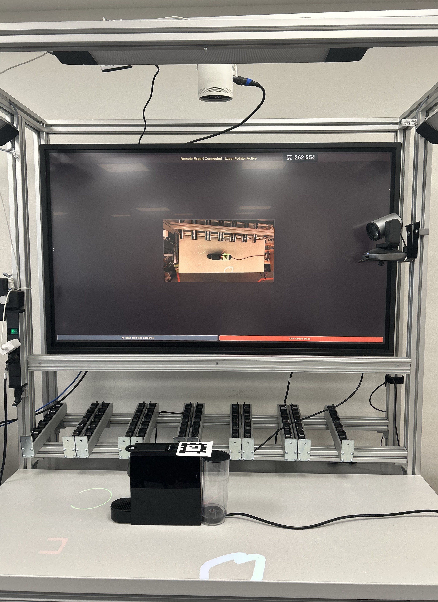
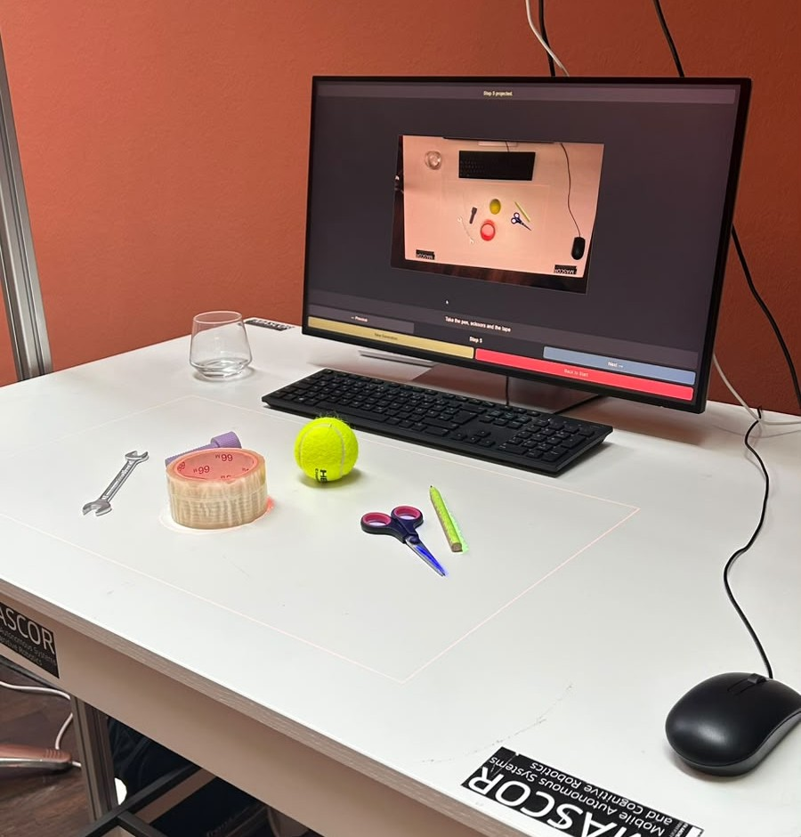

# Projection-Based Augmented Reality Assembly Assistance

This research **demonstrator** was developed as part of a **bachelor's thesis** and further extended during work as a **research assistant (HiWi)**. The system presents a **projection-based augmented reality assembly assistance approach**, integrating **computer vision** and **projection technology** to support the creation and execution of assembly instructions.

By using **AprilTags**, the system dynamically tracks objects in real-time, aligning projected instructions precisely to the assembly surface. It additionally offers a **browser-based remote assistance mode** and an **AI-assisted guidance mode** that generates spoken, step-by-step instructions from a camera image and a natural-language prompt via a remote AI PC.

<table align="center">
  <tr>
    <td align="center" width="50%">
      
      <br/>
      <em>The assembly station — Samsung Freestyle projector and Intel RealSense depth camera over an AprilTag-tracked workspace.</em>
    </td>
    <td align="center" width="50%">
      
      <br/>
      <em>Compact setup in AI-assisted mode — a generated step projected onto real objects, inside the red projection-area border.</em>
    </td>
  </tr>
</table>

> 🎥 **Video tutorial:** A full walkthrough of setting up and operating the system is available in
> [`Projection-based_Assembly_Tutorial.mov`](Projection-based_Assembly_Tutorial.mov) (in the repository
> root). Watch it alongside this README and the [user guide](user_guide.md) for a visual, step-by-step guide.

## Table of Contents

- [Features](#features)
- [Prerequisites](#prerequisites)
- [Installation](#installation)
- [Quick Start](#quick-start)
- [Running the Application](#running-the-application)
- [Project Structure](#project-structure)
- [Architecture Overview](#architecture-overview)
- [Known Issues](#known-issues)

---

## Features

- **AprilTag-Based Object Tracking**  
  Detects AprilTags and estimates 6-DOF object pose using an Intel RealSense D435 depth camera with depth-fusion smoothing and OneEuroFilter stabilization.

- **Manual Creation**  
  Capture workspace snapshots, annotate them with a built-in SVG drawing tool (brush, shapes, arrows, text), and organize steps into branching flowcharts with Yes/No decisions, subroutines, and merging branches. During annotation the detected tag boundary is overlaid on the snapshot so drawings are made at the correct physical scale.

- **Manual Playback**  
  Load published manuals and project each step's instruction SVG onto the physical workspace in real time, dynamically following the AprilTag's position.

- **Browser-Based Remote Assistance**  
  A separate web server streams the live camera feed (MJPEG) to any phone or tablet on the network. A remote expert draws directly on the video (pen, text, rectangle, circle, color, width) and the overlay is forwarded live over WebSocket to the main application, which projects it onto the workspace.

- **AI-Assisted Step-by-Step Guidance**  
  Send a camera image and a natural-language prompt to a remote AI PC. The application launches an inference server on that PC over SSH and communicates with it over HTTP: the AI generates a complete multi-step assembly manual and returns one step at a time (text description + SVG overlay + spoken **text-to-speech narration**). A fresh camera frame is sent on each Next/Previous navigation so the AI sees the current state of the workspace. The SVG is projected as a 3D overlay on the estimated table plane — no AprilTag required.

- **Static Projection-Area Border**  
  A thin red border is always projected at the edges of the projector output, showing the user the exact bounds of the projection area regardless of the current content.

- **GPU-Accelerated Rendering**  
  SVG instructions are rendered via OpenGL `NV_path_rendering` (NVIDIA-only), supporting both 3D tag-tracked projection and no-tag 3D table-plane projection.

- **Multi-Process Architecture**  
  The camera server runs as a separate process writing frames to shared memory, allowing the main GUI and the remote-assistance web server to consume frames simultaneously without hardware conflicts.

---

## Prerequisites

- **OS:** Windows 10 or higher
- **Python:** 3.11
- **GPU:** NVIDIA GPU with `NV_path_rendering` support
- **Hardware:**
  - Intel RealSense D435 camera
  - Samsung Freestyle 2nd Gen projector (or any secondary display)
  - AprilTags (printed, default size 7.3 cm)
- **Calibration file:** `data/projector_camera_calibration/calibration.yml`  
  Generated with [ProCamCalib](https://github.com/BingyaoHuang/single-shot-pro-cam-calib)

For **remote assistance** additionally:
- A phone or tablet with a browser on the same network as the host PC

For **AI-assisted guidance** additionally:
- A remote Linux PC reachable via SSH (e.g. over Tailscale) running the AI inference server (`flask_server.py`)
- SSH key-based authentication configured

---

## Installation

```bash
git clone https://github.com/ENKRAN/Praxisprojekt_Projection-based_Assembly.git
cd Praxisprojekt_Projection-based_Assembly
pip install -r requirements.txt
```

> **Note on the video tutorial (Git LFS):** the setup video is stored via
> [Git LFS](https://git-lfs.com/). If Git LFS is installed before you clone, the video is fetched
> automatically. If you cloned without it, you'll get a small pointer file instead of the video —
> install LFS and pull it once:
>
> ```bash
> git lfs install
> git lfs pull
> ```

> **Note on the `websocket` dependency:** the remote-assistance forwarder requires
> [`websocket-client`](https://pypi.org/project/websocket-client/), **not** the unrelated
> legacy `websocket` package. Both install a top-level `websocket` module and conflict, so if
> you previously had the wrong one installed, remove it first:
>
> ```bash
> pip uninstall -y websocket
> pip install websocket-client
> ```
>
> A stale install shows up as `[Forwarder] connect failed: module 'websocket' has no attribute
> 'create_connection'` when running the remote-draw server, and drawings silently fail to project.

Place your calibration file at:
```
data/projector_camera_calibration/calibration.yml
```

Runtime settings live in `data/user_config.json`. The screen names and debug flag are written automatically by the on-startup screen selector; the tag size and AI/SSH fields are edited by hand:

```json
{
    "gui_screen_name": "LU28R55",
    "proj_screen_name": "LU28R55",
    "debug_mode": true,
    "tag_size": 0.073,
    "ssh_host": "100.x.x.x",
    "ssh_user": "ai_user",
    "ssh_key_path": "~/.ssh/id_rsa",
    "remote_script_path": "/home/ai_user/segment/run_segment.py",
    "remote_work_dir": "/home/ai_user/segment/",
    "remote_python_path": "/home/ai_user/segment/.venv/bin/python3",
    "remote_venv_path": ""
}
```

| Field | Purpose |
|---|---|
| `gui_screen_name` / `proj_screen_name` | Displays chosen in the startup selector (auto-saved) |
| `debug_mode` | Run without hardware using a static test image |
| `tag_size` | AprilTag edge length in meters |
| `ssh_host` / `ssh_user` / `ssh_key_path` | AI PC connection (key-based auth) |
| `remote_work_dir` / `remote_python_path` / `remote_venv_path` | Where and how the AI server is launched on the AI PC |

See `user_guide.md` for a full setup walkthrough including RealSense SDK installation and calibration.

---

## Quick Start

The camera server must be started **first**; the main GUI and (optionally) the remote-assistance server read from it:

```bash
# 1. Start the camera server (owns the RealSense hardware, writes to shared memory)
python run_camera_server.py

# 2. Launch the main GUI (in a second terminal)
python main.py

# 3. (Optional) Start the remote-assistance web server (in a third terminal)
#    Serves the drawing page at http://<this-pc-ip>:5000
python -m remote_draw.remote_draw_server.run
```

The screen selector dialog appears on startup — choose which display is the GUI and which is the projector. Enable **Debug Mode** to run without physical hardware using a static test image.

---

## Running the Application

### Create a Manual
1. Click **Create Manual** → **Start New Manual**, enter a title.
2. Click **Start Live** and point the camera at an AprilTag.
3. Click **Capture** — the system detects the tag and records the homography.
4. Select a node type (Operation, Decision, etc.) and enter a description.
5. Annotate the snapshot with the drawing tool (the tag boundary is shown for scale) and click **Save**.
6. Repeat for each step. Click **Finish Manual** to publish.

### Load and Execute a Manual
1. Click **Load Manual**, select a published manual, click **Start Assembly**.
2. The first step is projected onto the workspace automatically.
3. Navigate with **Previous / Next** (or **Yes / No** for decision nodes).

### Remote Assistance Mode
1. In the main app, click **Remote Assistance Mode**.
2. Point the camera at the AprilTag and click **Snapshot** to bake the projection position.
3. Start the remote-assistance server: `python -m remote_draw.remote_draw_server.run`.
4. On a phone or tablet, open `http://<host-pc-ip>:5000` — the live camera feed appears.
5. Draw on the video (pen, text, rectangle, circle). Each stroke is forwarded to the main app and projected onto the workspace live.

### AI Object Segmentation
1. Configure SSH/AI settings in `data/user_config.json`.
2. Click **AI Object Segmentation** on the home screen.
3. Enter a prompt (e.g. *"guide me through assembling the pump"*) and click **Generate Manual**. The app connects to the AI PC over SSH, starts the inference server (models can take ~30–60 s to load), and requests the first step.
4. Step 1 is projected immediately and its narration is played aloud.
5. Use **Next →** / **← Previous** to walk through steps — a fresh frame is sent each time so the AI sees the current workspace state.
6. Click **New Generation** to start over with a new prompt.

---

## Project Structure

```
.
├── main.py                          # GUI entry point
├── run_camera_server.py             # Camera server entry point (run first)
├── requirements.txt
├── user_guide.md                    # Full setup + usage walkthrough
├── data/
│   ├── user_config.json             # Runtime settings (screens, tag size, SSH/AI config)
│   ├── manuals/                     # Stored manuals (JSON + snapshots + SVGs)
│   ├── remote_drawings/             # Auto-saved SVGs from remote-assistance sessions
│   └── projector_camera_calibration/
│       └── calibration.yml          # Required: projector-camera calibration
├── remote_draw/                     # Browser-based remote drawing client
│   ├── receiver_ws.py               # Standalone WebSocket receiver (debug/testing)
│   └── remote_draw_server/
│       ├── run.py                   # Entry point: reads shared memory, serves web app
│       ├── webapp.py                # Flask app: MJPEG video feed + touch drawing canvas
│       ├── remote_server.py         # Threads: web server, SVG saver, forwarder
│       ├── forwarder.py             # Forwards drawn SVGs to main app (ws://…:9001)
│       ├── mjpeg.py                 # MJPEG stream generator
│       ├── saver.py                 # Persists drawings to data/remote_drawings/
│       ├── state.py                 # Thread-shared state
│       ├── svg_utils.py             # SVG wrapping/formatting
│       └── config.py                # Ports, JPEG quality, forwarding config
├── legacy/                          # Previous (pre-refactor) implementation — reference only
└── app/
    ├── core/
    │   ├── domain.py                # Data classes: StepData, ManualData
    │   ├── config.py                # Calibration loading
    │   ├── user_settings.py         # user_config.json access
    │   ├── manual_manager.py        # Manual creation and persistence
    │   ├── flowchart_manager.py     # Flowchart logic and SVG generation
    │   ├── player_manager.py        # Manual playback and step sequencing
    │   ├── remote_server.py         # WebSocket server (receives SVGs on port 9001)
    │   └── ai_ssh_client.py         # SSH-launched AI Flask server + HTTP step workers
    ├── hardware/
    │   ├── camera.py                # RealSense capture service (CameraService)
    │   ├── camera_server.py         # Camera server process (writes to shared memory)
    │   └── shared_camera_client.py  # Shared memory reader (GUI + remote draw)
    ├── rendering/
    │   └── projector_window.py      # OpenGL NV_path_rendering + static red border
    ├── ui/
    │   ├── main_window.py           # Central orchestrator
    │   ├── components/
    │   │   ├── camera_view.py
    │   │   ├── clickable_svg_widget.py
    │   │   ├── dialogs.py
    │   │   ├── screen_selector.py   # GUI/projector display picker + debug mode
    │   │   └── drawing/             # Palette, zoomable view, interactive scene
    │   └── pages/
    │       ├── start_page.py
    │       ├── creation_page.py
    │       ├── node_selection_page.py
    │       ├── drawing_page.py
    │       ├── load_page.py
    │       ├── player_page.py
    │       ├── remote_page.py
    │       └── ai_generation_page.py
    ├── utils/
    │   ├── svg_utils.py             # SVG parsing, generation, optimization
    │   └── math_utils.py            # Homography, extrinsic matrix, color helpers
    └── vision/
        ├── detector.py              # AprilTag detection (pupil-apriltags)
        ├── pose_estimator.py        # 6-DOF pose with depth fusion + OneEuroFilter
        ├── table_estimator.py       # RANSAC depth-plane fitting for AI no-tag mode
        ├── visualization.py         # Debug overlays
        └── worker.py                # VisionWorker QThread
```

---

## Architecture Overview

| Module | Responsibility |
|---|---|
| `core` | Domain models, manual/flowchart/player management, config, WebSocket server, SSH/HTTP AI client |
| `hardware` | RealSense camera server + shared memory client |
| `vision` | AprilTag detection, 6-DOF pose estimation, RANSAC table-plane fitting, background QThread |
| `rendering` | GPU SVG projection — 3D tag-tracked and no-tag table-plane modes, plus the static border |
| `ui` | PyQt6 pages + central orchestrator (`main_window.py`) |
| `utils` | SVG and math helpers |
| `remote_draw` | Standalone Flask/MJPEG web server for browser-based remote drawing |

**Process model:** `run_camera_server.py` owns the RealSense hardware and writes frames to named shared memory (`cam_color`, `cam_depth`, `cam_meta`). The main GUI and the remote-draw web server both read via `SharedCameraClient`, without opening the camera device themselves.

**Rendering modes:**
- *Tag-tracked* (manual playback, remote assistance): SVG projected through the full 3D chain (Projector → Camera → Tag → SVG plane) using a baked homography from AprilTag detection.
- *No-tag 3D* (AI generation): each frame, a RANSAC plane is fitted to the depth data; SVG camera-pixel coordinates are back-projected through the camera intrinsics onto that plane, then transformed to projector space via the stereo extrinsics.
- The static red projection-area border is drawn last, in screen space, so it is always visible regardless of tracking state or loaded content.

**Remote assistance data flow:** camera server → shared memory → `remote_draw` server (MJPEG feed + drawing page on port 5000) → drawn SVG over WebSocket → forwarded to the main app's `RemoteSVGServer` (port 9001) → projected onto the workspace.

**AI guidance data flow:** the app opens an SSH session to the AI PC (keeping it alive so the server shuts down on disconnect), launches the inference server, then POSTs the camera frame + prompt to `/generate` and subsequent frames + action to `/navigate` (port 5005). Each response returns a step description, an SVG overlay, and a text-to-speech WAV (fetched via SFTP) that is played back locally.

---

## Known Issues

- **NVIDIA GPU required** — `NV_path_rendering` is NVIDIA-only. The app will not render projections on other GPUs.
- **Bright ambient light** may interfere with AprilTag detection. Use diffuse, consistent lighting.
- **Projection misalignment** — re-run ProCamCalib calibration if projections are off.
- **Remote assistance requires a baked snapshot** — take a snapshot in Remote Assistance Mode before drawings can be projected, and ensure the phone/tablet is on the same network as the host PC.
- **AI generation requires the AI PC** — ensure it is reachable via SSH and that the inference server (`flask_server.py`) is present in the configured work directory before using AI mode.
- **Developed and tested on Windows** — the codebase contains no Windows-specific APIs (`winreg`, Win32, etc.). All core dependencies (`pyrealsense2`, `PyQt6`, `NV_path_rendering` on NVIDIA, `paramiko`, `Flask`, `screeninfo`) are available on Linux. A Linux port is planned; expect minor setup differences (RealSense udev rules, display/screen name format) but no architectural blockers.
