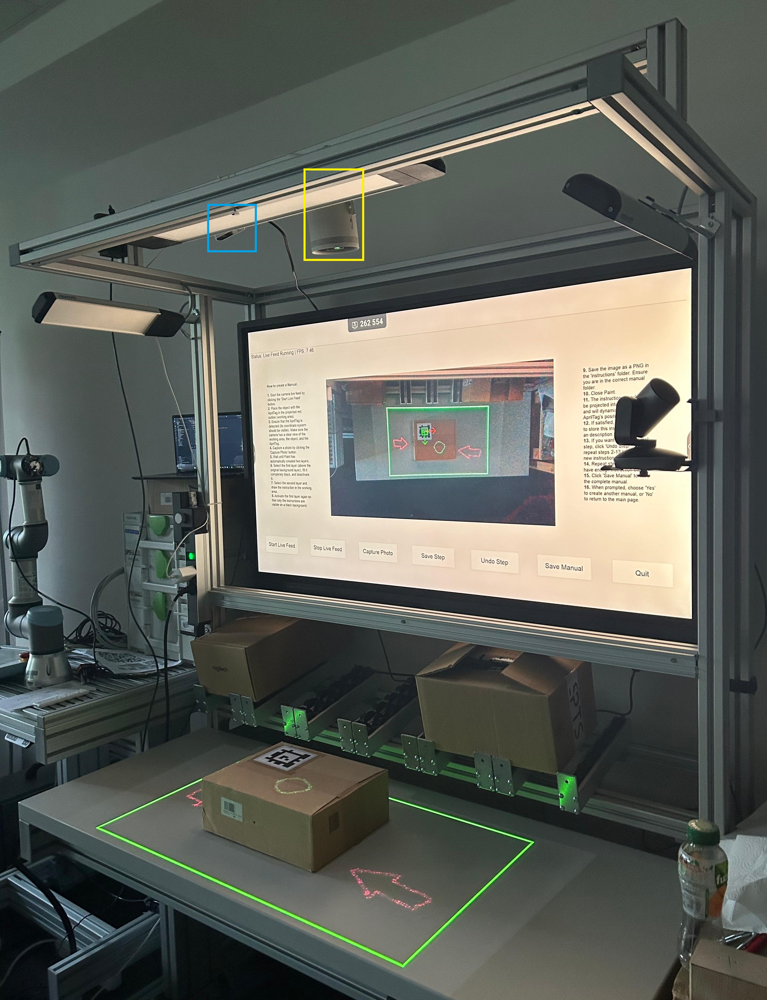

# Projection-Based Augmented Reality Assembly Assistance

This research **demonstrator** was developed as part of a **bachelor's thesis** and further extended during work as a **research assistant (HiWi)**. The system presents a **projection-based augmented reality assembly assistance approach**, integrating **computer vision** and **projection technology** to support the creation and execution of assembly instructions.

By using **AprilTags**, the system dynamically tracks objects in real-time, aligning projected instructions precisely to the assembly surface. Additionally, it features an **AI-assisted guidance mode** that generates step-by-step instructions from a camera image and a natural-language prompt via a remote AI PC.

<div style="text-align: center;">
    
</div>

## Table of Contents

- [Features](#features)
- [Prerequisites](#prerequisites)
- [Installation](#installation)
- [Quick Start](#quick-start)
- [Running the Application](#running-the-application)
- [Project Structure](#project-structure)
- [Architecture Overview](#architecture-overview)
- [Known Issues](#known-issues)

---

## Features

- **AprilTag-Based Object Tracking**  
  Detects AprilTags and estimates 6-DOF object pose using an Intel RealSense D435 depth camera with depth-fusion smoothing and OneEuroFilter stabilization.

- **Manual Creation**  
  Capture workspace snapshots, annotate them with a built-in SVG drawing tool (brush, shapes, arrows, text), and organize steps into branching flowcharts with Yes/No decisions, subroutines, and merging branches.

- **Manual Playback**  
  Load published manuals and project each step's instruction SVG onto the physical workspace in real time, dynamically following the AprilTag's position.

- **Remote Assistance Mode**  
  A remote expert connects via WebSocket and sends SVG overlays that are projected onto the workspace live.

- **AI-Assisted Step-by-Step Guidance**  
  Send a camera image and a natural-language prompt to a remote AI PC via SSH. The AI generates a complete multi-step assembly manual and returns one step at a time (description + SVG overlay). A fresh camera frame is sent on each Next/Previous navigation so the AI sees the current state of the workspace. The SVG is projected as a flat screen overlay — no AprilTag required.

- **GPU-Accelerated Rendering**  
  SVG instructions are rendered via OpenGL `NV_path_rendering` (NVIDIA-only), supporting both 3D tag-tracked projection and flat 2D overlay mode.

- **Two-Process Architecture**  
  The camera server runs as a separate process writing frames to shared memory, allowing the main GUI and other tools to consume frames without hardware conflicts.

---

## Prerequisites

- **OS:** Windows 10 or higher
- **Python:** 3.11
- **GPU:** NVIDIA GPU with `NV_path_rendering` support
- **Hardware:**
  - Intel RealSense D435 camera
  - Samsung Freestyle 2nd Gen projector (or any secondary display)
  - AprilTags (printed, default size 7.3 cm)
- **Calibration file:** `data/projector_camera_calibration/calibration.yml`  
  Generated with [ProCamCalib](https://github.com/BingyaoHuang/single-shot-pro-cam-calib)

For AI-assisted guidance additionally:
- A remote Linux PC reachable via SSH (e.g. over Tailscale)
- SSH key-based authentication configured

---

## Installation

```bash
git clone https://github.com/ENKRAN/Praxisprojekt_Projection-based_Assembly.git
cd Praxisprojekt_Projection-based_Assembly
pip install -r requirements.txt
```

Place your calibration file at:
```
data/projector_camera_calibration/calibration.yml
```

For SSH/AI configuration, edit `data/user_config.json`:
```json
{
    "tag_size": 0.073,
    "ssh_host": "100.x.x.x",
    "ssh_user": "ai_user",
    "ssh_key_path": "~/.ssh/id_rsa",
    "remote_script_path": "/home/ai_user/segment/run_segment.py",
    "remote_work_dir": "/tmp/ar_ai_work"
}
```

See `user_guide.md` for a full setup walkthrough including RealSense SDK installation and calibration.

---

## Quick Start

Two processes must be started **in order**:

```bash
# 1. Start the camera server (owns the RealSense hardware)
python run_camera_server.py

# 2. Launch the main GUI (in a second terminal)
python main.py
```

The screen selector dialog appears on startup — choose which display is the GUI and which is the projector. Enable **Debug Mode** to run without physical hardware using a static test image.

---

## Running the Application

### Create a Manual
1. Click **Create Manual** → **Start New Manual**, enter a title.
2. Click **Start Live** and point the camera at an AprilTag.
3. Click **Capture** — the system detects the tag and records the homography.
4. Select a node type (Operation, Decision, etc.) and enter a description.
5. Annotate the snapshot with the drawing tool and click **Save**.
6. Repeat for each step. Click **Finish Manual** to publish.

### Load and Execute a Manual
1. Click **Load Manual**, select a published manual, click **Start Assembly**.
2. The first step is projected onto the workspace automatically.
3. Navigate with **Previous / Next** (or **Yes / No** for decision nodes).

### Remote Assistance Mode
1. Click **Remote Assistance Mode**.
2. Point the camera at the AprilTag and click **Snapshot** to bake the projection position.
3. A remote expert connects via WebSocket (port 9001) and draws SVG overlays.

### AI Object Segmentation
1. Configure SSH settings in `data/user_config.json`.
2. Click **AI Object Segmentation** on the home screen.
3. Enter a prompt (e.g. *"guide me through assembling the pump"*) and click **Generate Manual**.
4. Step 1 is returned and projected immediately.
5. Use **Next →** / **← Previous** to walk through steps — a fresh frame is sent each time.
6. Click **New Generation** to start over with a new prompt.

---

## Project Structure

```
.
├── main.py                          # GUI entry point
├── run_camera_server.py             # Camera server entry point (run first)
├── requirements.txt
├── ai_pc_prompt.txt                 # Prompt for setting up the AI PC script
├── data/
│   ├── user_config.json             # Runtime settings (tag size, SSH config, screens)
│   ├── manuals/                     # Stored manuals (JSON + snapshots + SVGs)
│   └── projector_camera_calibration/
│       └── calibration.yml          # Required: projector-camera calibration
└── app/
    ├── core/
    │   ├── domain.py                # Data classes: StepData, ManualData
    │   ├── config.py                # Calibration loading
    │   ├── user_settings.py         # user_config.json access
    │   ├── manual_manager.py        # Manual creation and persistence
    │   ├── flowchart_manager.py     # Flowchart logic and SVG generation
    │   ├── player_manager.py        # Manual playback and step sequencing
    │   ├── remote_server.py         # WebSocket server for remote assistance
    │   └── ai_ssh_client.py         # SSH workers for AI PC communication
    ├── hardware/
    │   ├── camera_server.py         # RealSense server (writes to shared memory)
    │   └── shared_camera_client.py  # Shared memory reader used by GUI process
    ├── rendering/
    │   └── projector_window.py      # OpenGL NV_path_rendering + ProjectorWindow
    ├── ui/
    │   ├── main_window.py           # Central orchestrator
    │   ├── components/              # CameraView, drawing tools, dialogs, palette
    │   └── pages/
    │       ├── start_page.py
    │       ├── creation_page.py
    │       ├── node_selection_page.py
    │       ├── drawing_page.py
    │       ├── load_page.py
    │       ├── player_page.py
    │       ├── remote_page.py
    │       └── ai_generation_page.py
    ├── utils/
    │   ├── svg_utils.py             # SVG parsing, generation, optimization
    │   └── math_utils.py            # Homography, extrinsic matrix, color helpers
    └── vision/
        ├── detector.py              # AprilTag detection (pupil-apriltags)
        ├── pose_estimator.py        # 6-DOF pose with depth fusion + OneEuroFilter
        ├── visualization.py         # Debug overlays
        └── worker.py                # VisionWorker QThread
```

---

## Architecture Overview

| Module | Responsibility |
|---|---|
| `core` | Domain models, manual/flowchart/player management, config, SSH AI client |
| `hardware` | RealSense camera server + shared memory client |
| `vision` | AprilTag detection, 6-DOF pose estimation, background QThread |
| `rendering` | GPU SVG projection — 3D tag-tracked and flat 2D overlay modes |
| `ui` | PyQt6 pages + central orchestrator (`main_window.py`) |
| `utils` | SVG and math helpers |

**Process model:** `run_camera_server.py` owns the RealSense hardware and writes frames to named shared memory (`cam_color`, `cam_depth`, `cam_meta`). The main GUI reads via `SharedCameraClient`.

**Rendering modes:**
- *Tag-tracked*: SVG projected through the full 3D chain (Projector → Camera → Tag → SVG plane) using a baked homography from AprilTag detection.
- *Flat overlay*: SVG rendered with orthographic projection directly onto the projector screen — used by AI generation mode, no AprilTag required.

---

## Known Issues

- **NVIDIA GPU required** — `NV_path_rendering` is NVIDIA-only. The app will not render projections on other GPUs.
- **Bright ambient light** may interfere with AprilTag detection. Use diffuse, consistent lighting.
- **Projection misalignment** — re-run ProCamCalib calibration if projections are off.
- **AI generation requires SSH** — ensure the AI PC is reachable before using AI mode.
- **Developed and tested on Windows** — the codebase contains no Windows-specific APIs (`winreg`, Win32, etc.). All core dependencies (`pyrealsense2`, `PyQt6`, `NV_path_rendering` on NVIDIA, `paramiko`, `screeninfo`, the `diagrams` CLI) are available on Linux. A Linux port is planned; expect minor setup differences (RealSense udev rules, display/screen name format) but no architectural blockers.
