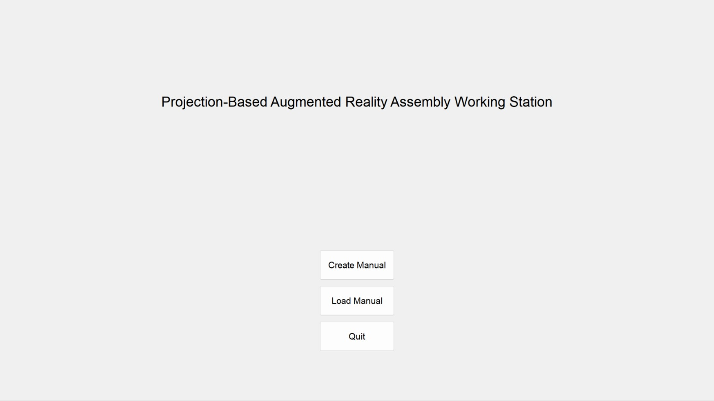
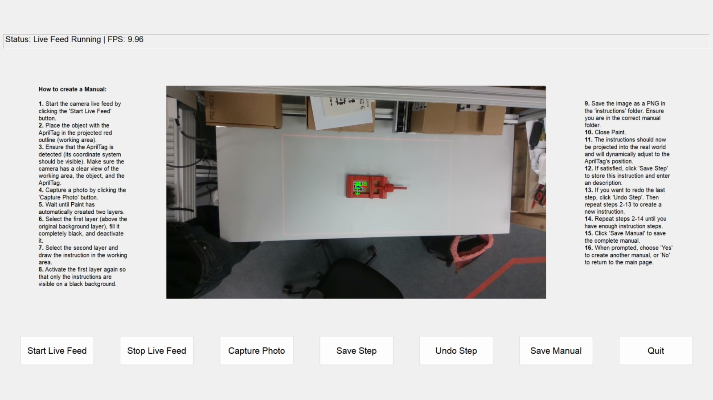
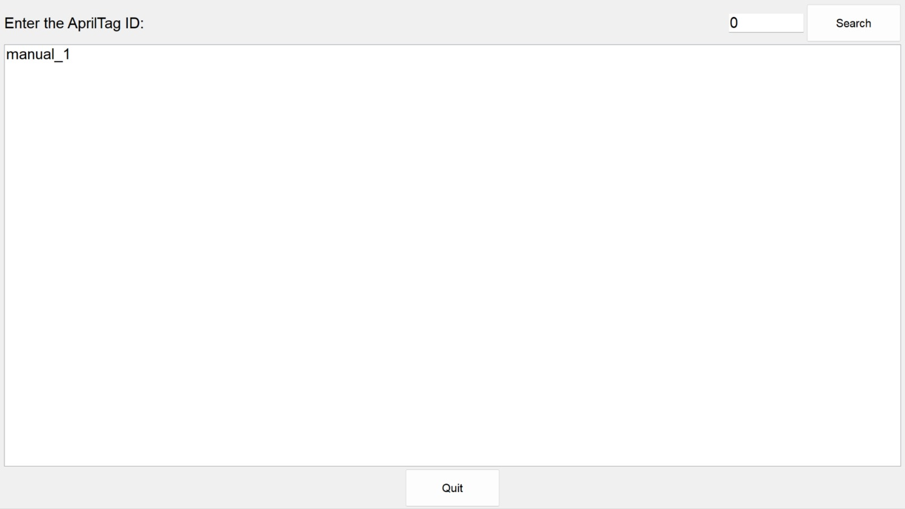
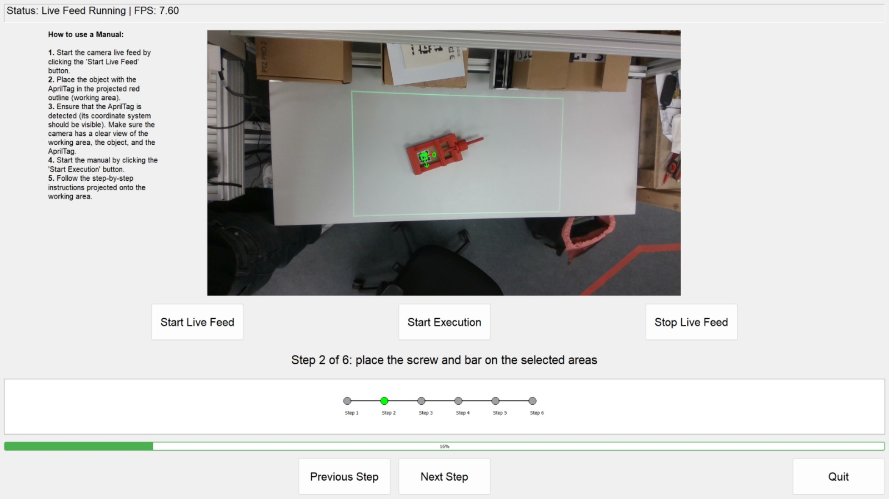

# Setup Instructions for Projection-Based Augmented Reality Assembly Assistance

This document provides a **detailed step-by-step guide** to setting up and using the **Projection-Based Augmented Reality Assembly Assistance** system. The system allows users to **create, store, and project assembly instructions** dynamically using a camera, projector, and AprilTag tracking.

## Table of Contents

- [Hardware Setup](#hardware-setup)
- [Software Setup](#software-setup)
- [Detailed Usage Guide](#detailed-usage-guide)

---

## Hardware Setup

1. **Intel RealSense D435 Camera**:
   - Connect the camera to a **USB 3.2** port on your computer (important: it **must** be USB 3.2 for full functionality).
   - Position the camera **next to the projector** at an angle that captures the entire assembly workspace.

2. **Samsung Freestyle Projector**:
   - Connect the projector to your computer via **wireless screen mirroring** or **HDMI** if available.
   - Ensure the projector’s resolution matches the RealSense camera’s **RGB resolution** for accurate alignment.
   - Position the projector to cover the **entire workspace** where the assembly instructions will be displayed.

3. **iiyama TV Monitor**:
   - Set up the monitor as an **extended display** for monitoring camera feeds and displaying instructions.

4. **AprilTags**:
   - Print AprilTags as required and attach them to the **assembly components**.
   - Place tags **in the camera’s field of view** for accurate tracking.

---

## Software Setup

1. **Clone the Repository**:

   ```bash  
   git clone https://github.com/ENKRAN/Praxisprojekt_Projection-based_Assembly.git  
   cd Praxisprojekt_Projection-based_Assembly  
   ```

2. **Install Python Dependencies**:  
   ```bash  
   pip install -r requirements.txt  
   ```

3. **Install Intel RealSense SDK**:
   - Visit the Intel RealSense [SDK Download Page](https://www.intelrealsense.com/sdk-2/) and download the latest SDK.
   - Follow the installation instructions provided on the Intel website.

---

## Detailed Usage Guide

### Step 1: Initial Setup

1. **Connect Hardware**:
   - Ensure that the **touchscreen, camera, and projector** are connected and positioned correctly.
   - ⚠️ **Important:** Connect the touchscreen and camera **before** the projector, otherwise the **GUI placement may be incorrect**.

2. **Calibration**:
   - Make sure that the **Projector-Camera System** is properly calibrated for accurate projections using the **ProCamCalib** software: [GitHub - ProCamCalib](https://github.com/BingyaoHuang/single-shot-pro-cam-calib).

3. **Start the Program**:
   ```bash  
   python -m src.main  
   ```
   - The **Start Page** should now appear on the touchscreen:

   <div style="text-align: center;">
       
   </div>

---

### Step 2: Creating Assembly Instructions

<div style="text-align: center;">
    
</div>

1. **Capture Workspace Image**:
   - Click **"Capture Photo"** to capture the **current view** from the RealSense camera.
   - The captured image will **automatically open** in Microsoft Paint.

2. **Draw Instructions**:
   - A **black background layer** and a **drawing layer** will be created.
   - Fill the **background layer** with black and make it **invisible**.
   - On the **drawing layer**, sketch the assembly instructions.
   - Make the background visible again, so that only the drawings remain on a **black background**.
   - Save the file as a **PNG** in `data/manuals/manual_x/` (`x` represents the manual number).

3. **Automatic Drawing Transformation**:
   - The saved image is analyzed by the software.
   - Contours and coordinates are extracted.
   - The drawings are transformed and **aligned with the AprilTag** for **real-time projection**.

4. **Verify & Confirm Steps**:
   - Check if the **projected instructions** align correctly.
   - Enter a **description** for the step and press **"Confirm Step X"**.

---

### Step 3: Searching for Saved Instructions

<div style="text-align: center;">
    
</div>

1. **Enter AprilTag ID**:
   - Type the AprilTag ID into the search field and press **"Search"**.

2. **Choose a Manual**:
   - The corresponding **manuals will be listed**.
   - Click on a manual to **load it for execution**.

---

### Step 4: Running an Instruction Manual

<div style="text-align: center;">
    
</div>

1. **Starting the Process**:
   - Start the **Live Feed** by clicking **"Start Live Feed"**.
   - Begin execution by clicking **"Start Execution"**.

2. **Follow Instructions**:
   - The **assembly steps** are displayed on the **monitor**.
   - The corresponding **instructions are projected** onto the workspace.
   - Follow the instructions **step-by-step**.

3. **Final Verification**:
   - After all steps are completed, the **progress bar will be full**.
   - Your **assembly should now be complete**!

---

## Troubleshooting & Tips

### Common Issues

| Issue | Solution |
|-----------------|-----------------------------------------------------------------|
| **Projection Misalignment** | Ensure correct **calibration** using ProCamCalib. |
| **Live Feed Not Displaying** | Check if the **camera is connected** and restart. |
| **AprilTag Not Detected** | Ensure the tag is **clearly visible** to the camera. |
| **Performance Issues** | Avoid excessive drawings, or optimize your system. |

For further **questions or issues**, refer to the **project’s GitHub repository**.
